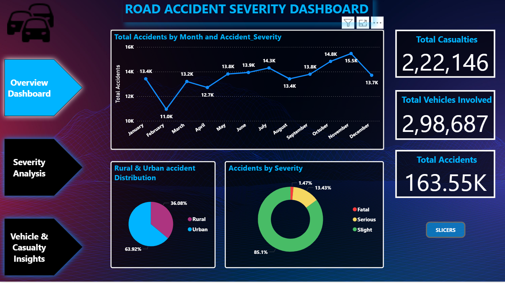
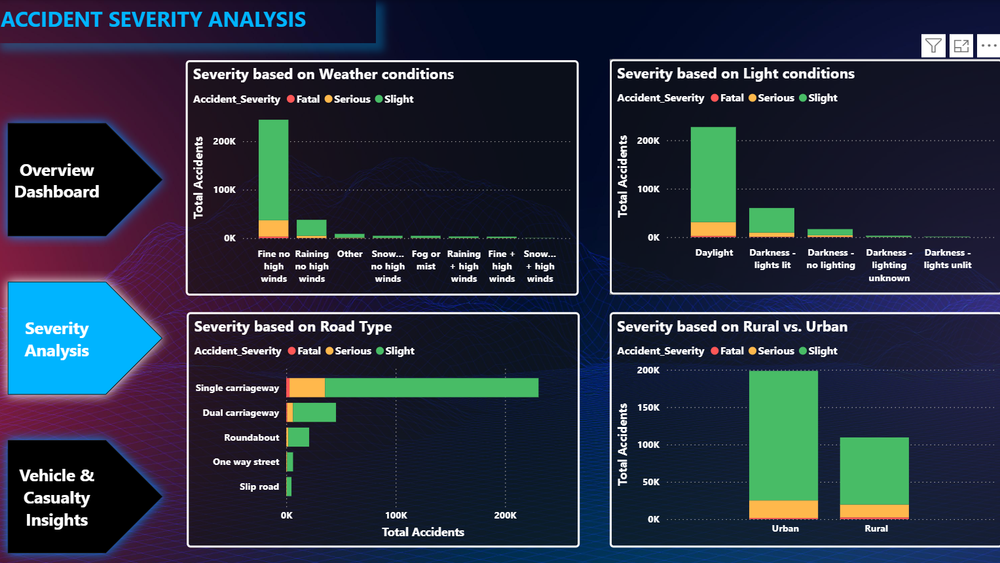
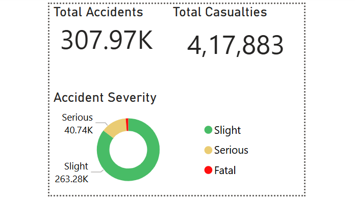
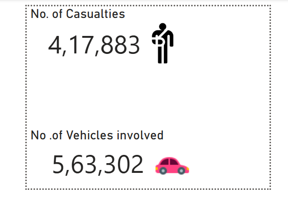

# 🚦Road Accident Analysis Dashboard (Power BI)
A comprehensive **Power BI dashboard project** designed to analyze road accidents in the UK.  
This dashboard provides insights into accident patterns, severity levels, vehicle involvement, casualty details, and environmental conditions.
---
## Dataset
Link: [Link](https://www.kaggle.com/datasets/paramitasen/powerbi-dashboard-road-accidents-analytics)
---
## 📌 1. Project Overview
This project aims to uncover patterns in UK road accidents using interactive dashboards.
---
## 📁 2. Project Structure
├── Data/
├── Dashboard.pbix
├── Dashboard_images/
│ ├── Overview Dashboard.png
│ ├── Severity Analysis.png
│ ├── Vehicle & Casualty Insights.png
│ ├── Overview Tooltip.png
│ ├── Severity Tooltip.png
└── README.md
---
## 🎯 3. Objectives
- Identify major accident trends  
- Analyze severity levels  
- Study vehicle involvement  
- Understand casualties  
- Evaluate weather & road conditions  
---
## 📊 4. Dashboards
### 🔹 4.1 Overview Dashboard

---
### 🔹 4.2 Accident Severity Analysis Dashboard

---
### 🔹 4.3 Vehicle & Casualty Insights Dashboard

---
## ✨ 5. Interactive Tooltips
### 🟡 Overview Tooltip

### 🟠 Severity Tooltip 

---
## 🛠 7. Tools Used
- Power BI Desktop  
- Excel / CSV  
- Power Query  
- DAX  
- GitHub
---
